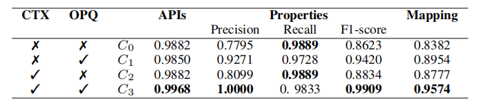

# LEGO
LEGO: Synthesizing IoT Device Components based on Static Analysis and Large Language Models

This repository is dedicated to sharing the experiment results and the data for the ICSE 2025 paper entitled LEGO: Synthesizing IoT Device Components based on Static Analysis and Large Language Models.

Project structure:
* DECG: source codes of our proposed dataflow-enhanced call graph (DECG)
* pycg: source codes of PyCG
* SDK_dataset: dataset of 50 SDKs used in RQ1
* RQ1: evaluation of RQ1
* RQ2: evaluation of RQ2
* RQ3: evaluation of RQ3


## DECG 

We constructs the DECG for a given device SDK to capture both explicit call relations and implicit dependencies between functions. 

The construction of DECG is based on an Identifier Assignment Graph (IAG) that records the points-to relations between identifiers.
We list the transformation rules omitted in the paper.


## Evaluation 

### RQ1 Evaluation


Prerequisites:
* Python >= 3.8

Getting DECG to run:

```bash
$ python DECG/__main__.py [module_path1 module_path2 module_path3...] [-o output_path]
# [module_path1, module_path2, ...] represents a list of paths to Python files, which can include any number of paths.
# The generated call relations are stored in a JSON file at the path specified by output_path.
```

*Example :* analyze SDK_dataset/broadlink/light.py.

```bash
$ python DECG/__main__.py SDK_dataset/broadlink/light.py -o cg.json
```


We evaluate the effectiveness of LEGO in identifying device SDK APIs in terms of precision and recall.
Furthermore, we replace DECG with the call graph generated by PyCG, a state-of-the-art call graph generator, and refer to the modified LEGO as LEGO-CG.
Run LEGO and LEGO-CG to identify SDK APIs from 50 SDKs in **SDK_dataset**.

```bash
# 1. run the script of testing LEGO
$ python RQ1/DECG_run.py
# 2. run the script of testing LEGO-CG
$ python RQ1/PyCG_run.py     
```

The output results of LEGO are stored in **RQ1/DECG_results**, and the output results of LEGO-CG are also stored in **RQ1/PyCG_results**.

The format of the results is as follows:
```
API number:9
SDK_dataset\aiohue\v2\controllers\lights.LightsController.set_color
SDK_dataset\aiohue\v2\controllers\lights.LightsController.set_color_temperature
SDK_dataset\aiohue\v2\controllers\lights.LightsController.turn_off
SDK_dataset\aiohue\v2\controllers\lights.LightsController.set_flash
SDK_dataset\aiohue\v2\controllers\lights.LightsController.set_brightness
SDK_dataset\aiohue\v2\controllers\base.BaseResourcesController.create
SDK_dataset\aiohue\v2\controllers\devices.DevicesController.set_identify
SDK_dataset\aiohue\v2\controllers\lights.LightsController.turn_on
SDK_dataset\aiohue\v2\__init__.HueBridgeV2.get_diagnostics
```

The ground truth of the SDK API is recorded in **RQ1/ground_truth**, which includes both control APIs and status query APIs.


```
Control APIs:
1.SDK_dataset\aiohue\v2\controllers\lights.LightsController.turn_on
2.SDK_dataset\aiohue\v2\controllers\lights.LightsController.turn_off
3.SDK_dataset\aiohue\v2\controllers\lights.LightsController.set_brightness
4.SDK_dataset\aiohue\v2\controllers\lights.LightsController.set_color
5.SDK_dataset\aiohue\v2\controllers\lights.LightsController.set_color_temperature
6.SDK_dataset\aiohue\v2\controllers\lights.LightsController.set_flash

Status query APIs:
1.SDK_dataset\aiohue\v2\models\light.Light.is_on
2.SDK_dataset\aiohue\v2\models\light.Light.brightness    
```

The precision and recall of two approaches can be calculated by comparing their identification results with the ground truth.

## RQ2 Evaluation

We design an ablation experiment to evaluate the impact of different contextual information on the accuracy of API understanding and property extraction by the LLM. The experiment involves the following 10 real-world devices.


Our designed prompt comprises augmented information, i.e., contextual information (CTX) and outputs from previous queries (OPQ). **prompt.py** demonstrates an example of our designed information-enhanced prompt.

We design four variations of the prompt (C0 to C3) to conduct an ablation study.The results are as follows:



The output results of the LLM using each set of prompts are documented separately in **RQ2/ablation_C0, RQ2/ablation_C1, RQ2/ablation_C2, RQ2/ablation_C3**.

### RQ3 Evaluation

We conducted an experiment with eight developers to evaluate the efficiency improvement of developing device components with LEGO.
We divide the developers into two groups.
The first group uses LEGO for component development, while the second group develops components manually.
We evaluate the effectiveness of LEGO in three aspects:
(a) the average development time for each device component
of the two groups, (b) the usability of the developed device
components, and (c) the recall of device properties. 

The results are as follows:


**RQ3/deviceComponent** presents several examples of device components synthesized using LEGO for KubeEdge.

